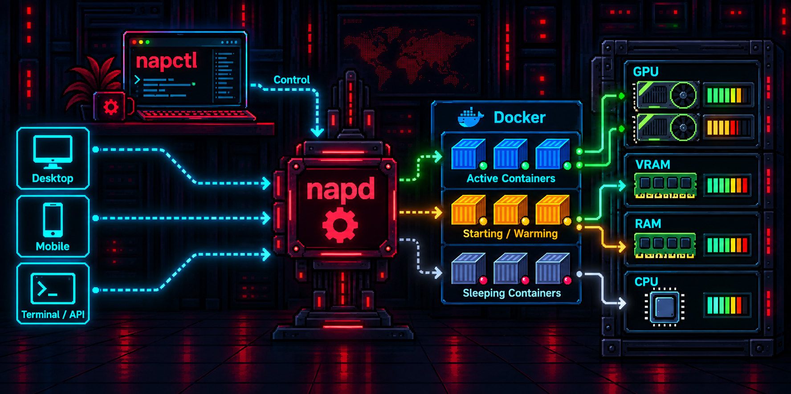
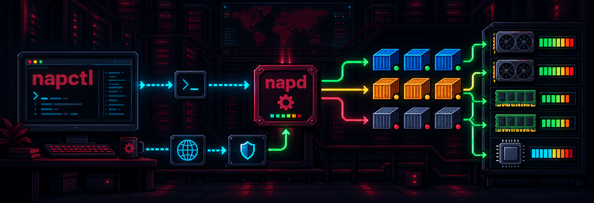
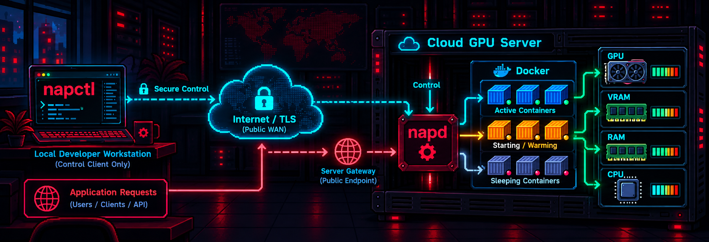

# napctl - Container Compute Orchestration



[](https://github.com/yousef-muc/napctl/releases)
[](LICENSE)
[](#-macos-install)
[](#-ubuntu--debian-install)
[](#-fedora-rhel-centos--compatible-install)
[](AGENTS.md)

`napctl` is the public binary distribution for napctl & napd, a local and edge
orchestrator for Docker containers. It wakes existing Docker containers on
request, waits for health checks, proxies HTTP traffic, observes CPU, RAM, GPU,
and VRAM resources, and can stop inactive containers when another requested
workload needs the same resources.

Container compute orchestration means that napctl does not replace Docker. Docker
still runs the containers. Napctl adds the control layer around those Docker
containers: resource-aware wake-on-request, healthcheck waiting, gateway
proxying, idle shutdown, remote control, and a terminal UI for operators.

The package name is always `napctl`. It installs both binaries:

- `napctl`: CLI and terminal UI client.
- `napd`: host agent, control API, gateway, and Docker workload orchestrator.

Install the same package everywhere. Start `napd` only on machines that should
manage Docker workloads. Client-only machines can use `napctl` without running
the daemon.

## 📦 Installation

Install `napctl` with the package manager for your platform. Linux packages
install both `napctl` and `napd`, but they do not automatically enable the
daemon on every machine. This is intentional: client-only workstations should
not accidentally become agent hosts.

Use the Linux agent host enablement steps only on machines that should manage
Docker containers.

### 🐧 Ubuntu & Debian Install

Use the one-line installer when you want the APT repository configured for you.

#### 1️⃣ Install from the APT repository

```sh
curl -fsSL https://yousef-muc.github.io/napctl/install.sh | sh
```

Manual APT setup:

```sh
sudo install -d -m 0755 /usr/share/keyrings
curl -fsSL https://yousef-muc.github.io/napctl/apt/gpg/napctl.gpg | sudo tee /usr/share/keyrings/napctl-archive-keyring.gpg >/dev/null
echo "deb [arch=$(dpkg --print-architecture) signed-by=/usr/share/keyrings/napctl-archive-keyring.gpg] https://yousef-muc.github.io/napctl/apt stable main" | sudo tee /etc/apt/sources.list.d/napctl.list >/dev/null
sudo apt update
sudo apt install napctl
```

#### 2️⃣ Verify the installed binaries

```sh
napctl version
napd --version
```

#### 3️⃣ Enable this Linux machine as an agent host

Run these only on machines that should manage Docker containers:

```sh
sudo usermod -aG docker nap
sudo usermod -aG nap "$USER"
sudo systemctl enable --now napd
```

After changing group membership, restart `napd` and open a new login shell:

```sh
sudo systemctl restart napd
```

#### 4️⃣ Verify Docker, GPU, and boot state

```sh
id nap
sudo -u nap docker ps
sudo -u nap nvidia-smi || true
systemctl is-active napd
systemctl is-enabled napd
sudo systemctl status napd --no-pager -l
```

Expected systemd state on an agent host:

```text
active
enabled
```

If `systemctl is-enabled napd` prints `disabled`, run:

```sh
sudo systemctl enable --now napd
```

#### 5️⃣ Update

```sh
sudo apt update
sudo apt install --only-upgrade napctl
sudo systemctl restart napd
```

### 🎩 Fedora, RHEL, CentOS, & Compatible Install

Use the DNF repository on Fedora, RHEL, CentOS Stream, and compatible systems.

#### 1️⃣ Install from the RPM repository

```sh
sudo curl -fsSL https://yousef-muc.github.io/napctl/rpm/napctl.repo -o /etc/yum.repos.d/napctl.repo
sudo dnf install napctl
```

The RPM repository metadata and RPM packages are signed with the published Nap
Linux repository key:

```text
https://yousef-muc.github.io/napctl/rpm/RPM-GPG-KEY-napctl
```

#### 2️⃣ Verify the installed binaries

```sh
napctl version
napd --version
```

#### 3️⃣ Enable this Linux machine as an agent host

```sh
sudo usermod -aG docker nap
sudo usermod -aG nap "$USER"
sudo systemctl enable --now napd
```

#### 4️⃣ Verify host access

```sh
id nap
sudo -u nap docker ps
sudo -u nap nvidia-smi || true
systemctl is-active napd
systemctl is-enabled napd
```

#### 5️⃣ Update

```sh
sudo dnf upgrade napctl
sudo systemctl restart napd
```

### 🍎 macOS Install

Use Homebrew on macOS. Client-only Macs do not need to start the service.

#### 1️⃣ Install with Homebrew

```sh
brew tap yousef-muc/tap
brew install napctl
```

#### 2️⃣ Verify

```sh
napctl version
napd --version
napctl config path
```

#### 3️⃣ Client-only setup

If the Mac controls remote Linux GPU servers, do not start the local service:

```sh
brew services stop napctl || true
```

#### 4️⃣ Optional local Docker host

If this Mac should manage local Docker workloads:

```sh
brew services start napctl
napctl doctor
napctl host inspect
```

#### 5️⃣ Update

```sh
brew update
brew upgrade napctl
```

## ⚙️ Configuration

Nap has two configuration sides:

- `napd` configuration lives on machines that manage Docker containers.
- `napctl` configuration lives on client machines that control local or remote
  agents.

Use `napctl config validate` after editing YAML. For multi-node client configs,
only one node can be marked `default: true`.

### 🧠 napd: Agent Host Configuration

`napd` is the host daemon. It runs next to Docker, exposes the local Unix
control socket, optionally exposes a remote control API, and owns the HTTP
gateway.

Linux package paths:

| Path | Purpose |
| --- | --- |
| `/etc/nap/nap.yaml` | Main daemon config: agent socket, gateway, services, resources. |
| `/etc/nap/napd.env` | Optional systemd environment file for secrets and overrides. |
| `/run/nap/napd.sock` | Local Unix control socket. |
| `/usr/lib/systemd/system/napd.service` | Packaged systemd unit on RPM systems. |
| `/lib/systemd/system/napd.service` | Packaged systemd unit on Debian-based systems. |

#### 1️⃣ Create Docker containers once

Nap manages existing Docker containers with:

```text
docker start
docker stop
docker inspect
docker logs
```

Create containers once with Docker or Docker Compose, then leave them stopped
for Nap to wake on demand:

```sh
cd /path/to/service-compose
docker compose up -d
docker stop CONTAINER_NAME
docker ps -a --format 'table {{.Names}}\t{{.Status}}\t{{.Ports}}'
```

Avoid `docker compose down` during normal Nap switching, because it can remove
the container Nap needs to start.

#### 2️⃣ Configure `/etc/nap/nap.yaml`

```yaml
agent:
  socket: /run/nap/napd.sock
  remote:
    listen: ""
    token_env: NAP_REMOTE_TOKEN

nodes:
  local:
    type: local
    default: true
    socket: /run/nap/napd.sock

gateway:
  listen: 0.0.0.0:8787

services:
  app:
    host: app.nap.local
    container: app
    target: http://127.0.0.1:8080
    healthcheck:
      url: http://127.0.0.1:8080/
      timeout: 120s
      interval: 2s
    resources:
      memory: 8GiB
      gpus:
        count: 1
        vendor: nvidia
        min_vram: 8GiB
    idle: 5m
    stop_timeout: 30s
```

#### 3️⃣ Understand the main YAML sections

| Section | Purpose |
| --- | --- |
| `agent.socket` | Local Unix socket used by local `napctl` and the packaged service. |
| `agent.remote.listen` | Remote control API listen address, for example `0.0.0.0:8788`. |
| `agent.remote.token_env` | Environment variable that contains the remote bearer token. |
| `nodes` | Client-style node definitions. On an agent host this usually contains `local`. |
| `gateway.listen` | HTTP gateway address. Public reverse proxies should point here. |
| `services.<name>.host` | Host header that selects the service at the gateway. |
| `services.<name>.container` | Existing Docker container name. |
| `services.<name>.target` | Internal URL to proxy to after the container is healthy. |
| `healthcheck.url` | URL Nap waits for before proxying traffic. |
| `resources.memory` | Memory budget used by the scheduler. |
| `resources.gpus.count` | Number of GPUs required. |
| `resources.gpus.vendor` | GPU vendor selector, for example `nvidia`. |
| `resources.gpus.min_vram` | Minimum VRAM requirement. |
| `idle` | Time after which an inactive service can be stopped. |
| `stop_timeout` | Grace period for stopping the Docker container. |

#### 4️⃣ Apply daemon config changes

```sh
sudo napctl --config /etc/nap/nap.yaml config validate
sudo systemctl restart napd
sudo napctl --config /etc/nap/nap.yaml --socket /run/nap/napd.sock service ls
```

If `service ls` is empty, `napd` is running but no services are configured yet.

### 🔐 napd: Environment File And Remote Tokens

Remote control lets a workstation run `napctl --node gpu-server ...` against a
server. Protect the remote API with a bearer token and restrict port `8788` to
trusted networks where possible.

#### 1️⃣ Generate a remote token on the server

```sh
napctl token --env NAP_REMOTE_TOKEN
```

#### 2️⃣ Store it in `/etc/nap/napd.env`

```sh
sudo tee /etc/nap/napd.env >/dev/null <<'EOF'
NAP_LOG_LEVEL=info
NAP_REMOTE_TOKEN=replace-with-generated-token
NAP_REMOTE_LISTEN=0.0.0.0:8788
NAP_REMOTE_TOKEN_ENV=NAP_REMOTE_TOKEN
EOF
sudo chmod 0600 /etc/nap/napd.env
sudo systemctl restart napd
```

#### 3️⃣ Show the configured token again on an agent host

```sh
sudo grep '^NAP_REMOTE_TOKEN=' /etc/nap/napd.env
sudo sed -n 's/^NAP_REMOTE_TOKEN=//p' /etc/nap/napd.env
```

#### 4️⃣ Supported `napd` environment variables

| Variable | Flag | Purpose |
| --- | --- | --- |
| `NAP_CONFIG` | `--config` | Path to `nap.yaml`. |
| `NAP_SOCKET` | `--socket` | Local control socket. |
| `NAP_GATEWAY_LISTEN` | `--gateway-listen` | HTTP gateway listen address. |
| `NAP_REMOTE_LISTEN` | `--remote-listen` | Remote-control API listen address. |
| `NAP_REMOTE_TOKEN` | `--remote-token` | Remote-control bearer token. |
| `NAP_REMOTE_TOKEN_ENV` | `--remote-token-env` | Env var name containing the remote token. |
| `NAP_REMOTE_TLS_CERT` | `--remote-tls-cert` | TLS certificate for remote control. |
| `NAP_REMOTE_TLS_KEY` | `--remote-tls-key` | TLS private key for remote control. |
| `NAP_LOG_LEVEL` | `--log-level` | `debug`, `info`, `warn`, or `error`. |

### 💻 napctl: Client Configuration

`napctl` reads a local `nap.yaml` and optional environment variables. It does
not have a separate global `.env` file.

Common client paths:

| Platform | Path |
| --- | --- |
| macOS | `$HOME/Library/Application Support/nap/nap.yaml` |
| Linux | `$HOME/.config/nap/nap.yaml` |
| Any | `napctl config path` |
| Override | `NAP_CONFIG=/path/to/nap.yaml napctl ...` |

#### 1️⃣ Configure one remote node

```yaml
nodes:
  gpu-server:
    type: remote
    default: true
    url: http://SERVER_IP:8788
    token_env: NAP_REMOTE_TOKEN
```

#### 2️⃣ Configure multiple remote nodes

Only one node may be `default: true`:

```yaml
nodes:
  gpu-server:
    type: remote
    default: true
    url: http://SERVER_IP:8788
    token_env: NAP_REMOTE_TOKEN

  gpu-server-2:
    type: remote
    url: http://SECOND_SERVER_IP:8788
    token_env: NAP_REMOTE_TOKEN_2
```

Validate before launching the TUI:

```sh
napctl config validate
napctl node ls
```

#### 3️⃣ Use session-only token environment variables

```sh
export NAP_REMOTE_TOKEN='replace-with-generated-token'
napctl --node gpu-server doctor
```

#### 4️⃣ Store tokens directly in local client config

This avoids repeated `export` commands. Use it only in a private local client
config:

```sh
printf '%s' 'replace-with-generated-token' | napctl node token set gpu-server --stdin
napctl --node gpu-server doctor
napctl
```

Direct flag form, only when shell-history exposure is acceptable:

```sh
napctl node token set gpu-server --token 'replace-with-generated-token'
```

Remove a direct token:

```sh
napctl node token unset gpu-server
```

## 🌐 Reverse Proxy Examples


Put the public reverse proxy in front of the napd gateway, not directly in front
of the container port. The proxy must send a `Host` header that matches a
service `host` entry in `nap.yaml`.

Example service:

```yaml
services:
  app:
    host: app.nap.local
    container: app
    target: http://127.0.0.1:8080
```

Host-based routing keeps the original URL simple. Path-based routing also works
when the proxy strips the public path prefix before forwarding to Nap.

### 🔌 WebSockets And Protocol Upgrades

The napd gateway supports WebSocket and HTTP protocol upgrades. This is
required by applications that keep a live connection open for progress,
events, queues, or interactive browser sessions. The reverse proxy in front of
napd must preserve the client's upgrade request.

- Caddy handles WebSocket upgrades automatically with `reverse_proxy`.
- nginx must use HTTP/1.1 and forward the `Upgrade` and `Connection` headers.
- Apache should enable `proxy_wstunnel` in addition to `proxy` and
  `proxy_http`.

Keep traffic routed through napd instead of bypassing it for WebSocket paths.
The WebSocket connection then counts as active service traffic, preventing idle
shutdown while the connection remains open.

### 🟣 Caddy

#### 1️⃣ Host-based

```caddyfile
app.example.com {
	reverse_proxy 127.0.0.1:8787 {
		header_up Host app.nap.local
	}
}
```

#### 2️⃣ Path-based

```caddyfile
example.com {
	handle_path /flux/* {
		reverse_proxy 127.0.0.1:8787 {
			header_up Host flux.nap.local
		}
	}

	handle_path /qwen/* {
		reverse_proxy 127.0.0.1:8787 {
			header_up Host qwen.nap.local
		}
	}
}
```

#### 3️⃣ Validate and reload

```sh
sudo caddy validate --config /etc/caddy/Caddyfile
sudo systemctl reload caddy
```

### 🟢 nginx

Define this map once in nginx's `http` context so normal HTTP connections and
WebSocket upgrades receive the correct `Connection` header:

```nginx
map $http_upgrade $connection_upgrade {
    default upgrade;
    ''      close;
}
```

#### 1️⃣ Host-based

```nginx
server {
    listen 80;
    server_name app.example.com;

    location / {
        proxy_http_version 1.1;
        proxy_set_header Upgrade $http_upgrade;
        proxy_set_header Connection $connection_upgrade;
        proxy_set_header Host app.nap.local;
        proxy_set_header X-Real-IP $remote_addr;
        proxy_set_header X-Forwarded-For $proxy_add_x_forwarded_for;
        proxy_set_header X-Forwarded-Proto $scheme;
        proxy_pass http://127.0.0.1:8787;
    }
}
```

#### 2️⃣ Path-based

```nginx
server {
    listen 80;
    server_name example.com;

    location /flux/ {
        rewrite ^/flux/?(.*)$ /$1 break;
        proxy_http_version 1.1;
        proxy_set_header Upgrade $http_upgrade;
        proxy_set_header Connection $connection_upgrade;
        proxy_set_header Host flux.nap.local;
        proxy_set_header X-Real-IP $remote_addr;
        proxy_set_header X-Forwarded-For $proxy_add_x_forwarded_for;
        proxy_set_header X-Forwarded-Proto $scheme;
        proxy_pass http://127.0.0.1:8787;
    }

    location /qwen/ {
        rewrite ^/qwen/?(.*)$ /$1 break;
        proxy_http_version 1.1;
        proxy_set_header Upgrade $http_upgrade;
        proxy_set_header Connection $connection_upgrade;
        proxy_set_header Host qwen.nap.local;
        proxy_set_header X-Real-IP $remote_addr;
        proxy_set_header X-Forwarded-For $proxy_add_x_forwarded_for;
        proxy_set_header X-Forwarded-Proto $scheme;
        proxy_pass http://127.0.0.1:8787;
    }
}
```

#### 3️⃣ Validate and reload

```sh
sudo nginx -t
sudo systemctl reload nginx
```

### 🟠 Apache

#### 1️⃣ Enable modules

```sh
sudo a2enmod proxy proxy_http proxy_wstunnel headers rewrite
sudo systemctl reload apache2
```

#### 2️⃣ Host-based

```apache
<VirtualHost *:80>
    ServerName app.example.com

    RequestHeader set Host "app.nap.local"
    ProxyPass "/" "http://127.0.0.1:8787/"
    ProxyPassReverse "/" "http://127.0.0.1:8787/"
</VirtualHost>
```

#### 3️⃣ Path-based

```apache
<VirtualHost *:80>
    ServerName example.com

    <Location "/flux/">
        RequestHeader set Host "flux.nap.local"
        ProxyPass "http://127.0.0.1:8787/"
        ProxyPassReverse "http://127.0.0.1:8787/"
    </Location>

    <Location "/qwen/">
        RequestHeader set Host "qwen.nap.local"
        ProxyPass "http://127.0.0.1:8787/"
        ProxyPassReverse "http://127.0.0.1:8787/"
    </Location>
</VirtualHost>
```

#### 4️⃣ Validate and reload

```sh
sudo apachectl configtest
sudo systemctl reload apache2
```

### 🎨 ComfyUI And WebSockets

ComfyUI uses WebSockets for live execution progress and queue updates. Its
browser interface also loads many JavaScript modules and API routes in
parallel. Route all of these requests through the same napd service so
wake-on-request, activity tracking, and idle shutdown continue to work.

Dedicated host-based routing is recommended for ComfyUI. It preserves root
paths such as `/ws`, `/api`, `/view`, and `/assets` without additional rewrite
rules.

#### 1️⃣ Configure the napd service

The example assumes the existing ComfyUI container listens on host port `8188`:

```yaml
services:
  comfyui:
    host: comfyui.nap.local
    container: comfyui
    target: http://127.0.0.1:8188
    healthcheck:
      url: http://127.0.0.1:8188/
      timeout: 180s
      interval: 2s
    resources:
      memory: 16GiB
      gpus:
        count: 1
        vendor: nvidia
        min_vram: 12GiB
    idle: 10m
    stop_timeout: 45s
```

Adjust the resource values to the workflows and models used by this ComfyUI
instance. Validate the configuration and restart napd after editing it:

```sh
sudo napctl --config /etc/nap/nap.yaml config validate
sudo systemctl restart napd
```

#### 2️⃣ Caddy configuration

Caddy forwards ordinary HTTP requests and WebSocket upgrades automatically:

```caddyfile
comfy.example.com {
	reverse_proxy 127.0.0.1:8787 {
		header_up Host comfyui.nap.local
	}
}
```

#### 3️⃣ nginx configuration

nginx needs the WebSocket upgrade headers explicitly:

```nginx
map $http_upgrade $connection_upgrade {
    default upgrade;
    ''      close;
}

server {
    listen 80;
    server_name comfy.example.com;

    location / {
        proxy_http_version 1.1;
        proxy_set_header Upgrade $http_upgrade;
        proxy_set_header Connection $connection_upgrade;
        proxy_set_header Host comfyui.nap.local;
        proxy_set_header X-Real-IP $remote_addr;
        proxy_set_header X-Forwarded-For $proxy_add_x_forwarded_for;
        proxy_set_header X-Forwarded-Proto $scheme;
        proxy_read_timeout 3600s;
        proxy_send_timeout 3600s;
        proxy_pass http://127.0.0.1:8787;
    }
}
```

#### 4️⃣ Verify the route

Open the public ComfyUI host in a browser and confirm that the interface,
preview updates, queue events, and execution progress work. The browser's
network inspector should show the WebSocket request with status `101 Switching
Protocols`.

For a local gateway check without the external reverse proxy:

```sh
curl -v -H 'Host: comfyui.nap.local' http://127.0.0.1:8787/
```

## 🚪 Gateway Requests

The Nap gateway routes HTTP traffic by `Host` header. Reverse proxies should
forward requests to the gateway and set `Host` to the configured service host.
When everything runs on one machine, local applications can also send requests
directly to the gateway.

### 1️⃣ Direct local gateway request

```sh
curl -v -H 'Host: app.nap.local' http://127.0.0.1:8787/
```

### 2️⃣ Remote gateway request

```sh
curl -v -H 'Host: app.nap.local' http://SERVER_IP:8787/
```

### 3️⃣ What happens after the request arrives

`napd` checks resources, stops safe preemption candidates if required, starts
the configured Docker container, waits for the healthcheck, and then proxies the
request to the configured `target`.

## 🖥️ Terminal UI Commands

Run `napctl` to open the dashboard. With multiple configured nodes, the right
side shows all nodes and the selected node drives the services, host metrics,
and `/` commands.

### 1️⃣ Global keys

| Key | Action |
| --- | --- |
| `/` | Open the command palette. |
| `r` | Refresh nodes, services, and host metrics. |
| `n` or `Tab` | Select the next node. |
| `p` or `Shift+Tab` | Select the previous node. |
| `Enter` or `i` | Inspect the selected service. |
| `s` | Start the selected service if stopped, or stop it if running. |
| `x` | Restart the selected service. |
| `l` | Show logs for the selected service. |
| `q` or `Ctrl+C` | Quit. |

### 2️⃣ Command palette

| Command | What it does |
| --- | --- |
| `/doctor` | Validate config and check the selected `napd` agent. |
| `/config validate` | Validate the active `nap.yaml` without contacting `napd`. |
| `/host inspect` | Show runtime, CPU, RAM, GPU, VRAM, and GPU process details. |
| `/node ls` | List configured nodes from the client config. |
| `/service ls` | Refresh services from the selected node. |
| `/service inspect <name>` | Show service state, container, target, and resources. |
| `/service plan <name>` | Explain whether a service can start and what would be preempted. |
| `/service start <name>` | Start a configured container through `napd`. |
| `/service stop <name>` | Stop a configured container through `napd`. |
| `/service restart <name>` | Restart a configured container through `napd`. |
| `/service logs <name>` | Show recent Docker logs for a service. |
| `/top` | Return to the dashboard. |
| `/help` | Print available commands in the output panel. |
| `/quit` | Leave the TUI. |

## 🧩 How napctl & napd work together



`napctl` is the operator interface. It can run as a classic CLI, a terminal UI,
or a remote-control client. `napd` is the server-side agent. It runs on the host
that has Docker, RAM, CPU, GPUs, and the actual Docker containers.

### 1️⃣ Control plane

`napctl` talks to `napd` through one of two control paths:

- Local Unix socket: `/run/nap/napd.sock`.
- Remote HTTP control API: usually `http://SERVER_IP:8788` with a bearer token.

### 2️⃣ Data plane

Application traffic goes to the Nap gateway, usually `:8787`. The gateway
chooses the service by `Host` header, wakes the Docker container if needed, waits
for health, and proxies the request to the internal service target.

### 3️⃣ Resource orchestration

Before starting a service, `napd` inspects host resources. It can account for
CPU, available RAM, GPU count, GPU vendor, minimum VRAM, GPU utilization, and
GPU processes attributed to Docker containers.

If a requested service needs resources that are currently held by another idle
container, Nap can stop the inactive container and start the requested one. It
protects active HTTP requests, so services with in-flight traffic are not
preempted for normal switching.

### 4️⃣ Multi-GPU behavior

Multi-GPU hosts are modeled as one node with multiple detected GPUs. Services
can request GPU count, vendor, minimum VRAM, and explicit GPU indices when
needed. Nap inspects all GPUs on the host, reports aggregate and per-GPU usage
in the TUI, and uses the scheduler to decide whether the requested workload can
start or which inactive workload can be stopped first.

## 🧭 Deployment Scenarios

The same package supports local laptops, home-lab servers, office LAN servers,
and cloud GPU hosts. The difference is which machines run `napd`, where the
gateway is exposed, and how `napctl` reaches each node.

### 1. 🏠 Single Machine Without Reverse Proxy


Run both `napctl` and `napd` on one machine. Docker containers, the Nap gateway,
and the control socket all live on the same host.

#### How it works

- `napctl` controls local `napd` through `/run/nap/napd.sock`.
- Apps send HTTP requests directly to `http://127.0.0.1:8787`.
- Requests include `Host: app.nap.local`.
- `napd` starts the requested Docker container and proxies to its target.

#### Example request

```sh
curl -H 'Host: app.nap.local' http://127.0.0.1:8787/
```

### 2. 🏡 Single Machine With Caddy


Run `napctl`, `napd`, Docker, and Caddy on one machine. Caddy owns the public
URL, while Nap owns wake-on-request and resource orchestration.

#### How it works

- Public traffic reaches Caddy first.
- Caddy forwards to `127.0.0.1:8787`.
- Caddy sets `Host` to the matching Nap service host.
- `napd` wakes the right Docker container and proxies internally.

#### Example proxy target

```caddyfile
app.example.com {
	reverse_proxy 127.0.0.1:8787 {
		header_up Host app.nap.local
	}
}
```

### 3. 🌐 Local Client And LAN Server


Run `napctl` on a workstation and `napd` on one or more Docker/GPU servers in
the same local network.

#### How it works

- The workstation stores remote nodes in its local `nap.yaml`.
- `napctl` uses the remote control API on port `8788`.
- The server runs Docker containers, `napd`, the Nap gateway, and optionally
  Caddy.
- Local apps can call the server reverse proxy or the Nap gateway directly.

#### Example client node

```yaml
nodes:
  gpu-server:
    type: remote
    default: true
    url: http://SERVER_IP:8788
    token_env: NAP_REMOTE_TOKEN
```

### 4. ☁️ Local Client And Cloud GPU Server



Run `napctl` locally and `napd` on a remote cloud server with one or more GPUs.
This is the same model as the LAN setup, but network security matters more.

#### How it works

- `napctl` connects to the remote control API with a bearer token.
- The cloud server runs Docker containers, GPUs, `napd`, and a reverse proxy.
- The reverse proxy exposes public HTTPS routes.
- Nap gateway traffic should stay behind the reverse proxy when possible.

#### Production guidance

- Use HTTPS in front of public application traffic.
- Restrict remote control port `8788` to trusted IPs or private networking.
- Store remote tokens in `/etc/nap/napd.env` on the server.
- Store client tokens with `napctl node token set <node> --stdin` only on
  trusted local machines.

## 🤖 Coding Agent Installation

If you want ChatGPT Codex, OpenClaude, OpenCode, Pi, or another coding agent to
install and configure Nap for you, point it to [AGENTS.md](AGENTS.md). That file
contains package-manager install commands, role-specific setup rules,
remote-node configuration, reverse-proxy guidance, and a verification checklist.

## ✅ Verify Release Downloads

Every release includes `checksums.txt`.

```sh
shasum -a 256 -c checksums.txt
```

## 📄 License

Released under the MIT License. See [LICENSE](LICENSE).
